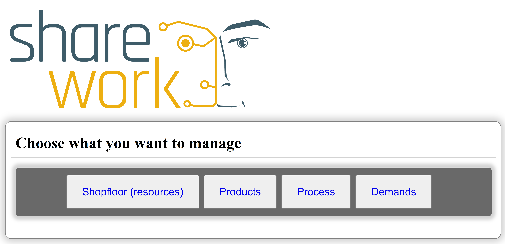
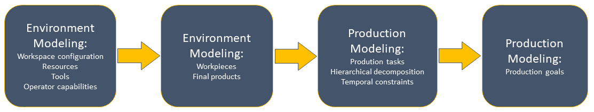

<a name="readme-top"></a>
<div align="center">
  <h1 align="center">TENANT</h1>
  <h3 align="center">Tool fostEriNg Ai plaNning in roboTics</h3>
  <h3 align="center">Stand-Alone version</h3>
</div>
</br>

## Table of Contents
- [Table of Contents](#table-of-contents)
- [About The Project](#about-the-project)
  - [Built With](#built-with)
- [Getting Started](#getting-started)
  - [Prerequisites](#prerequisites)
  - [Installation and Run](#installation-and-run)

## About The Project



__TENANT__ (Tool fostEriNg Ai plaNning in roboTics) is a knowledge engineering software tool that facilitates domain experts in the definition of a complete representation of the specific production knowledge of a whole manufactoring shop-floor. In particular, it can be used to define goals, tasks and a set operational constraints of a production process.

### Built With

[![Python][Python-shield]][Python-url] [![Flask][Flask-shield]][Flask-url] [![Jinja][Jinja-shield]][Jinja-url] [![JQuery][JQuery.com]][JQuery-url] [![SQLite][SQLite-shield]][SQLite-url]

## Getting Started

In **TENANT**, the knowledge base definition process consists of several modeling steps shown in the figure below.
</img>

The representation framework behind TENANT relies on a state-of-the-art ontology called [**SOHO**](https://github.com/pstlab/SOHO) (Sharework Ontology for Human-Robot Collaboration) expanded with some concepts from **OPIS**, a language defined for describing manufacturing processes.

### Prerequisites

* A linux distribution (**Ubuntu 18.04** has been used for running and testing the software)
* [Python 3](https://python.org) and pip
* [Virtualenv](https://virtualenv.pypa.io/en/latest/) (**not required but recommended**)

### Installation and Run

In order to run the software, follow the instructions below

1. Clone the repo and move into the folder
   ```sh
   git clone https://github.com/pstlab/TENANT_sa.git
   cd ./TENANT_sa
   ```
2. Create a virtual environment with virtualenv and activate it (**only if you want use virtualenv**)
   ```sh
   python3 -m pip install virtualenv
   python3 -m venv env
   source ./env/bin/activate
   ```
   * To **deactivate** the virtual environment use the command `deactivate`
3. Install the requirements contained in `requirements.txt`
   ```sh
   python3 -m pip install -r ./requirements.txt
   ```
4. To fill the database with toy scenarios, run (__not required__)
   ```sh
   python3 ./init_db.py
   # or
   python3 ./init_cembre.py
   ```
5. To initialize operator functions with a set of functions common in manufacturing scenarios, run (__not required__)
   ```sh
   python3 ./taxonomy_functions.py
   ```
6. Run the server
   ```sh
   python3 ./run.py
   ```
A local server will be started at `http://127.0.0.1:5000/`.
Open this address with any browser to use the software.

<p align="right">(<a href="#readme-top">back to top</a>)</p>

<!-- MARKDOWN LINKS & IMAGES -->
[SQLite-shield]: https://img.shields.io/badge/sqlite-%2307405e.svg?style=for-the-badge&logo=sqlite&logoColor=white
[SQLite-url]: https://www.sqlite.org/
[Flask-shield]: https://img.shields.io/badge/Flask-000000?style=for-the-badge&logo=flask&logoColor=white
[Flask-url]: https://flask.palletsprojects.com/en/2.2.x/
[Jinja-shield]: https://camo.githubusercontent.com/bf9a5122ae18817a5a34fad613bde9d31a53e1589ae8f960003c13136c59ff96/68747470733a2f2f696d672e736869656c64732e696f2f7374617469632f76313f7374796c653d666f722d7468652d6261646765266d6573736167653d4a696e6a6126636f6c6f723d423431373137266c6f676f3d4a696e6a61266c6f676f436f6c6f723d464646464646266c6162656c3d
[Jinja-url]: https://jinja.palletsprojects.com/en/3.1.x/
[Python-shield]: https://img.shields.io/badge/Python-3776AB?style=for-the-badge&logo=python&logoColor=white
[Python-url]: https://python.org
[JQuery.com]: https://img.shields.io/badge/jQuery-0769AD?style=for-the-badge&logo=jquery&logoColor=white
[JQuery-url]: https://jquery.com